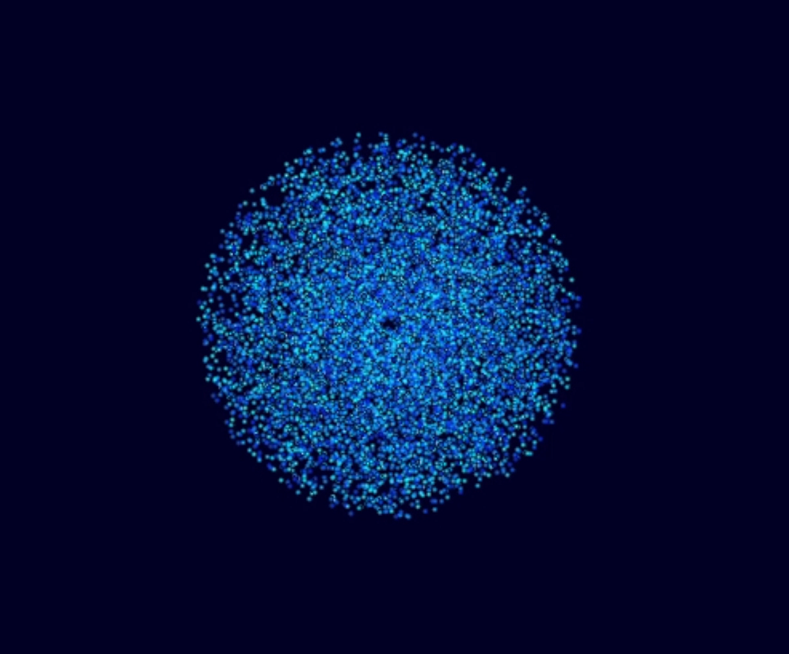
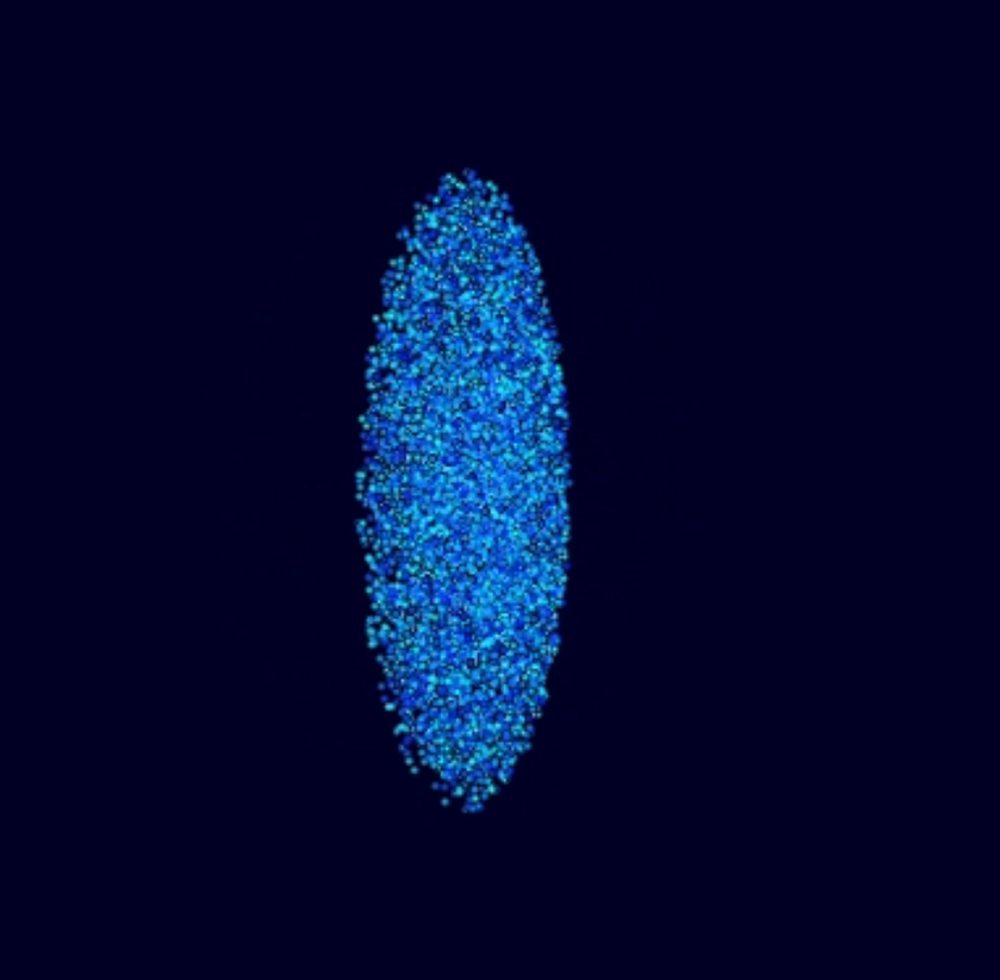

# Barnes-Hut N-Body Simulation with CUDA & OpenGL




A GPU-accelerated N-body gravity simulation using the Barnes-Hut algorithm (O(N log N) complexity) with real-time OpenGL visualization.

## Features

- 🪐 **Realistic galaxy simulation** with proper orbital velocities
- ⚡ **CUDA-accelerated** octree construction and force calculations
- 🌌 **3D visualization** with velocity-based coloring
- 📊 **Benchmark mode** for performance analysis

## Requirements

- NVIDIA GPU with CUDA support
- CUDA Toolkit (v11.0+ recommended)
- OpenGL/GLUT libraries
- GLEW (for OpenGL extensions)
- FFmpeg (for video capture)
- MobaXterm for rendering in ssh

## Installation & Usage

```bash
# Clone repository
git clone https://github.com/yourusername/barnes-hut-sim.git
cd barnes-hut-sim

# Build (default N=10000 particles)
make

# Run with visualization (ESC to quit)
make visualize

# Benchmark mode (no visualization)
make benchmark
